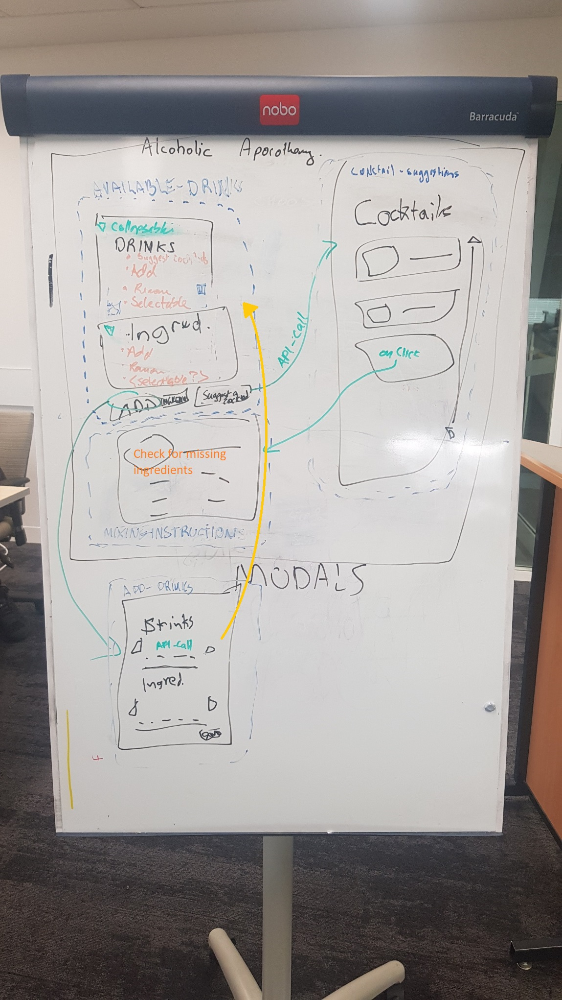

# Alcoholic Apothecary
 
 [Alcoholic Apothecary](https://macoovacany.github.io/ejctAlcoholicApothecary/)


## Project Description

## User stories

```
AS A USER I want to list the drinks I have
SO THAT I can see which cocktails I can make

GIVEN THAT I only have certain drinks and ingredients
WHEN I add stock
THEN I can select my available stock (rather than an autocorrect) (in a modal too I imagine)

WHEN I add ingredients
THEN I can select my available ingredients

WHEN I search cocktails
THEN results are returned, including names and thumbnails

WHEN I click on a drink
THEN the ingredients and method are shown

WHEN I add stock and ingredients
THEN the selection is stored in local storage
WHEN the page is refreshed
THEN the selection is saved

I figure we'll aim for this to be our MVP, of course we'll
keep it open to adding more functionality, like an option to save 
favourite drinks or tracking inventory of available drinks etc.
```

## Wire frame

*Work in Progress*


*Rough Draw up*


## API used

 * https://www.thecocktaildb.com/api.php


## Rough Breakdown of Features

1. modal to add stock
     1. autocomplete API
     2. 
1. mock out stock showing
2. API to call out ingredient
3. DIVs
    1. stock available
    2. suggested cocktails
    3. instructions to make
